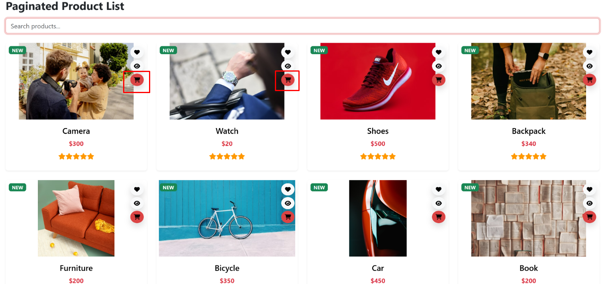

# Resultados de Pruebas Funcionales

Este documento presenta los resultados de las pruebas funcionales ejecutadas según los casos de prueba definidos en el documento de [casos de prueba](./CasosDePrueba.md).

## Caso de prueba CP01

### Agregar producto al carrito de compras

| ID   | Descripción                                     | Resultado |
| ---- | ---------------------------------------------- | --------- |
| CP01 | Agregar producto al carrito. | Exitoso   |
| CP01 | Intento de agregar producto sin autenticación | Fallido   |

### Capturas de pantalla

#### Agregar producto al carrito.

#### Intento de agregar producto sin autenticación.

---

## Caso de prueba CP02

### Visualizar el carrito de compras

| ID   | Descripción                                  | Resultado |
| ---- | -------------------------------------------- | --------- |
| CP02 | Visualización del carrito con productos     | Exitoso   |
| CP02 | Visualización del carrito vacío             | Exitoso   |

### Capturas de pantalla

#### Visualización del carrito con productos.

#### Visualización del carrito vacío.

---

## Caso de prueba CP03

### Actualizar cantidad de productos en el carrito

| ID   | Descripción                                      | Resultado |
| ---- | ----------------------------------------------- | --------- |
| CP03 | Actualizar cantidad de productos en el carrito | Exitoso   |
| CP03 | Intentar agregar más productos que el stock    | Fallido   |

### Capturas de pantalla

#### Actualizar cantidad de productos en el carrito.

#### Intento de agregar más productos que el stock.

---

## Caso de prueba CP04

### Eliminar un producto del carrito

| ID   | Descripción                         | Resultado |
| ---- | ----------------------------------- | --------- |
| CP04 | Eliminar producto del carrito      | Exitoso   |

### Capturas de pantalla

#### Eliminar producto del carrito.

---

## Caso de prueba CP05

### Crear una orden de compra

| ID   | Descripción                       | Resultado |
| ---- | --------------------------------- | --------- |
| CP05 | Creación de orden de compra      | Exitoso   |
| CP05 | Intento de orden sin productos   | Fallido   |

### Capturas de pantalla

#### Creación de orden de compra

#### Intento de crear orden sin productos en el carrito
Este escenario ha sido gestionado de forma que, si el carrito de un usuario está vacío, únicamente se mostrará la opción de 'Shop now', sin permitir la generación de una orden.

---

## Caso de prueba CP06

### Cancelar una orden

| ID   | Descripción                      | Resultado |
| ---- | -------------------------------- | --------- |
| CP06 | Cancelar una orden en estado "Pendiente" | Exitoso   |

### Capturas de pantalla

#### Cancelar orden en estado "Pendiente"

---

## Caso de prueba CP07

### Procesar un pago

| ID   | Descripción                          | Resultado |
| ---- | ------------------------------------ | --------- |
| CP07 | Procesar pago con datos válidos     | Exitoso   |
| CP07 | Intento de pago con tarjeta inválida | Fallido   |

### Capturas de pantalla

#### Procesar pago con datos válidos

#### Intento de pago con tarjeta inválida

---