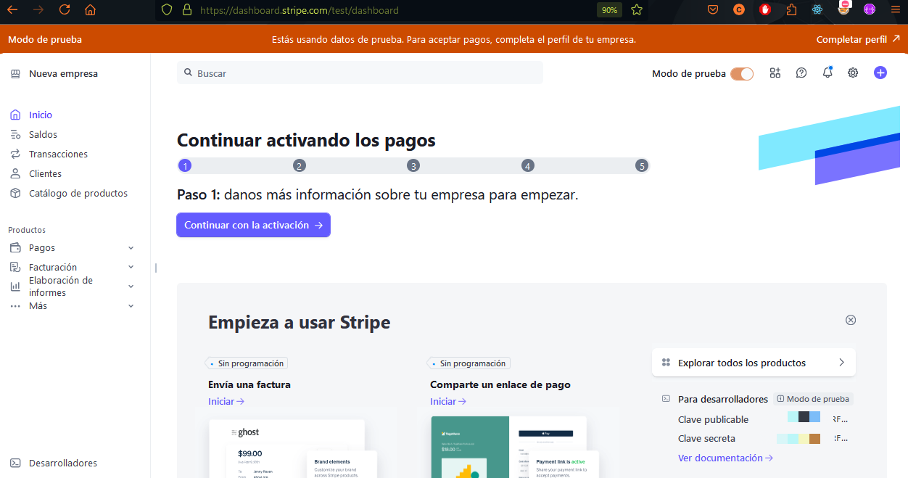
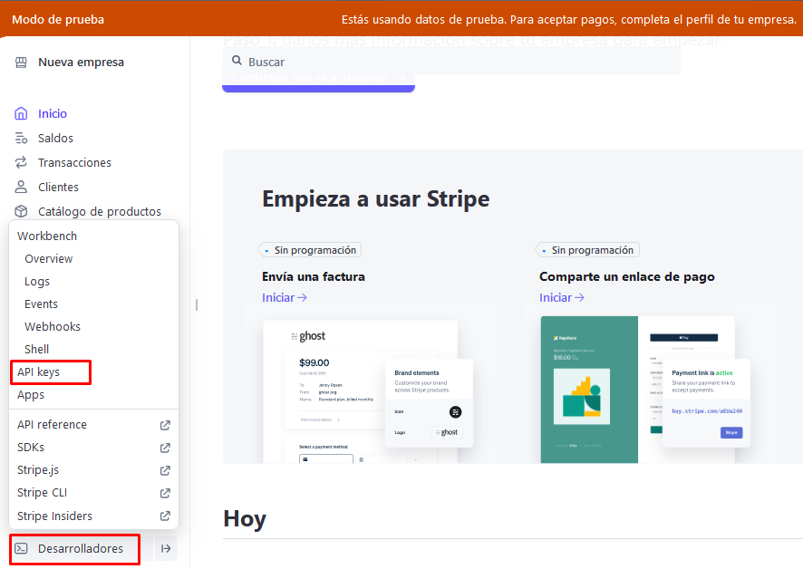
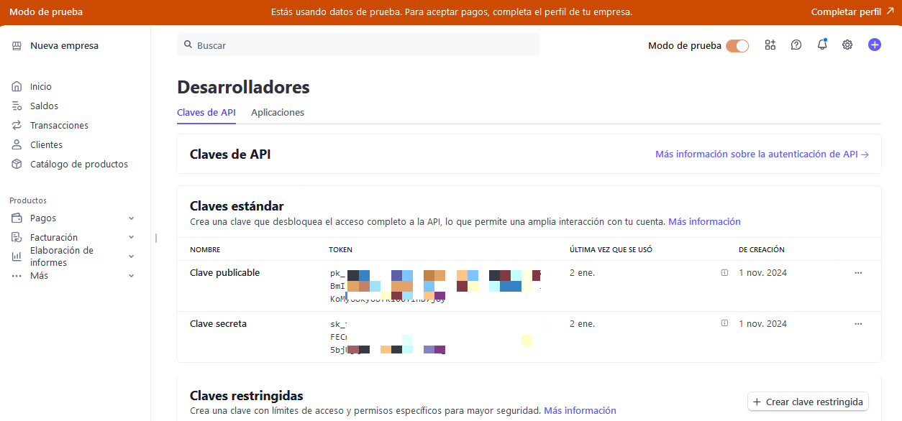
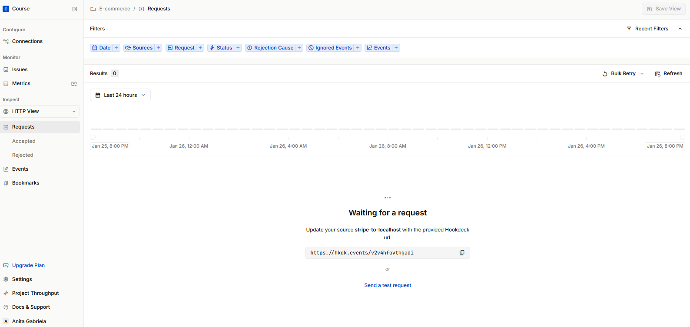
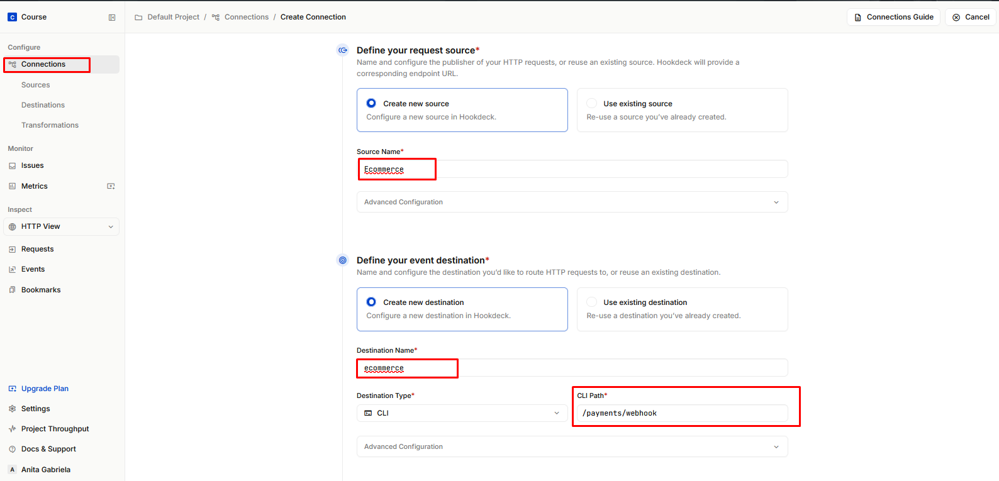
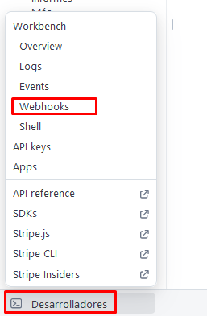
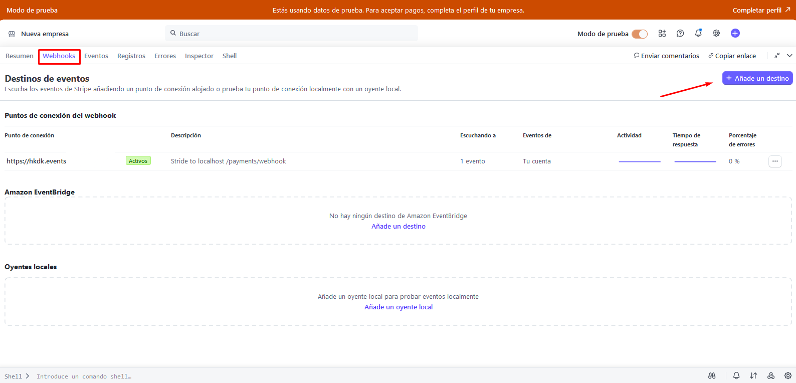
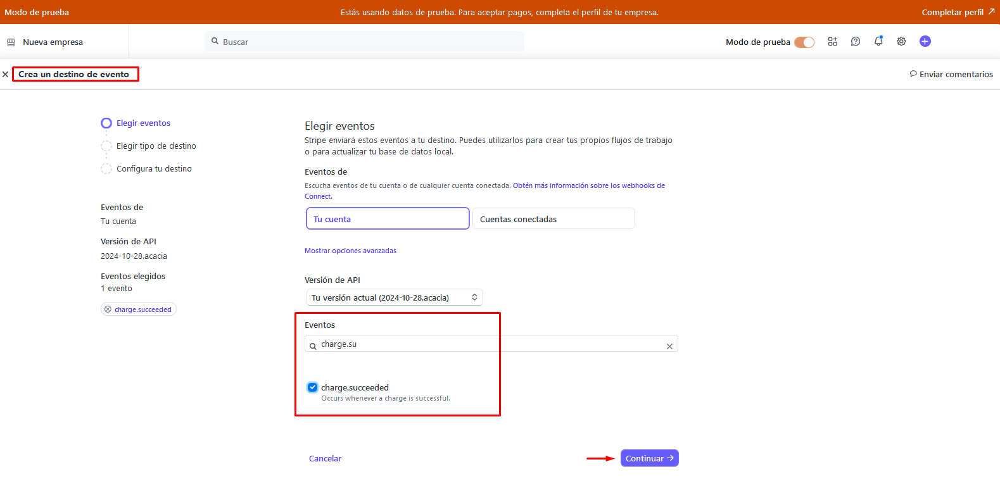
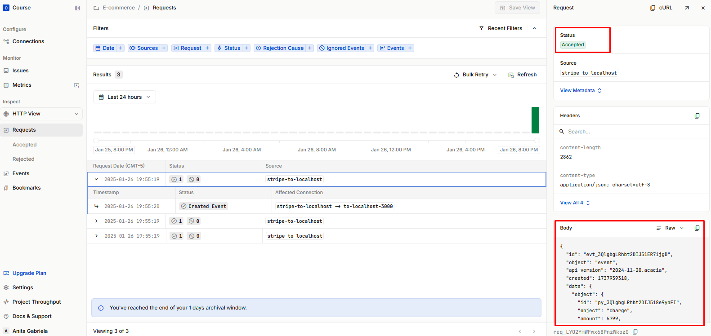
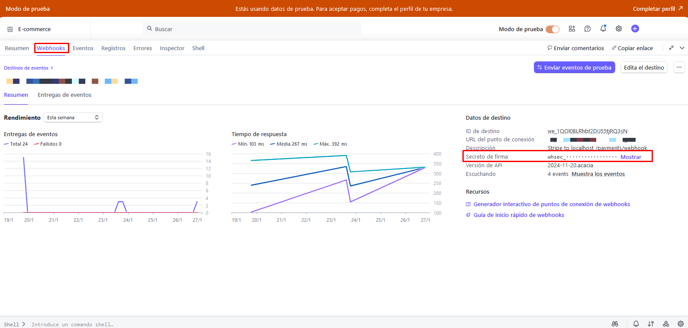

# ANEXO X: CONFIGURACIÓN DE STRIPE Y WEBHOOKS CON HOOKDECK

## 1. Configuración de Stripe

### 1.1. Creación de la cuenta en Stripe

- Registra una cuenta en [Stripe](https://stripe.com) proporcionando los datos necesarios.
- Una vez creada la cuenta, accede al panel principal.
- Es fundamental trabajar en "Modo prueba", ya que permite realizar todas las configuraciones y pruebas sin incurrir en costos    adicionales. Además, una vez todo esté validado, es fácil cambiar a "Modo producción" para comenzar a operar en un entorno real.
  
  

### 1.2. Configuración de claves API

- Accede al apartado de **Claves API** en la opción de `Desarrolladores`.

- Obtener las claves **public_key** y **secret_key**.
- Guardar estas claves en un entorno seguro (por ejemplo, variables de entorno).

---

## 2. Configuración de Webhooks con Hookdeck

### 2.1. Registro en Hookdeck

- Crear una cuenta en [Hookdeck](https://hookdeck.com) y acceder al panel principal.

### 2.2. Creación del endpoint en Hookdeck

- Dentro de Hookdeck, generar un nuevo endpoint para capturar eventos.
  - Agregar el nombre de la conexión a crear.
  - Al definir el destino, es importante tener en cuenta que este puede ser un servidor local (localhost) o una URL desplegada. Además, esta configuración se puede modificar más adelante si es necesario.

- Al finalizar la creación, es fundamental copiar el enlace del endpoint generado, ya que este será necesario para establecer la conexión con Stripe.
  
  El endpoint generado tiene el siguiente formato:
    `https://hkdk.events/{tu-endpoint-único}`

### 2.3. Configuración del Webhook en Stripe

- Acceder a la configuración de webhooks en Stripe.
  
  

- Agrega el endpoint generado por Hookdeck en la sección correspondiente.
  
  

- Seleccionar únicamente los eventos relevantes, como `charge.succeeded` o `payment_intent.succeeded`, según las funcionalidades específicas para el proyecto.
  
  Es importante evitar seleccionar todos los eventos disponibles, ya que existen muchas opciones y, al habilitar todos ellos, el tiempo de respuesta podría verse afectado negativamente debido al procesamiento innecesario de eventos irrelevantes.

    

### 2.4. Pruebas de conexión y funcionamiento

- Envíar un evento de prueba desde Stripe para verificar que el webhook funciona correctamente.
  y confirmar que Hookdeck recibe y muestra el evento.
  

---

## 3. Consideraciones de seguridad

- **Habilitar la validación de la firma del webhook en Stripe:**
  
  Acceder a la pestaña `Desarrolladores`, seleccionar la opción `Webhook` y eligir el evento que se configuró previamente para obtener la firma.

  

- **Almacena el secreto de firma de forma segura:**
  
  Guardar el secreto de firma de Stripe en una variable de entorno para protegerlo, asegura que la comunicación entre Stripe y la aplicación sea confiable, evitando manipulaciones de eventos o datos falsos que afecten el estado de los pagos.

---
