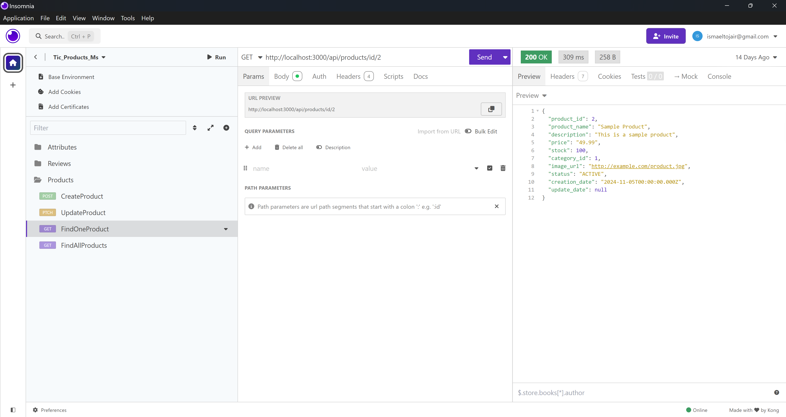
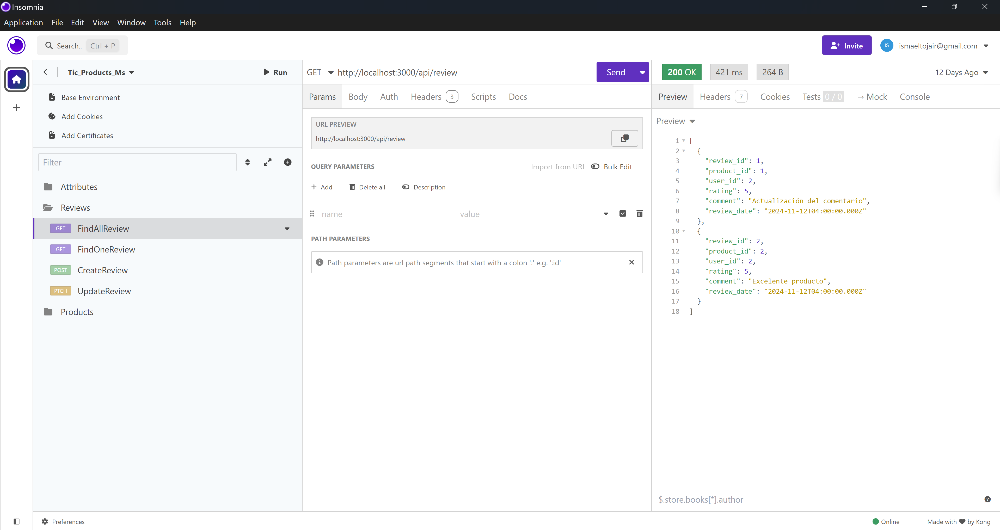
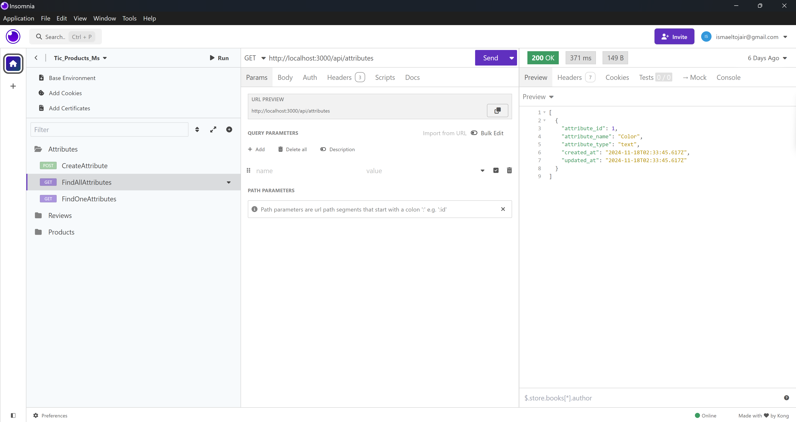
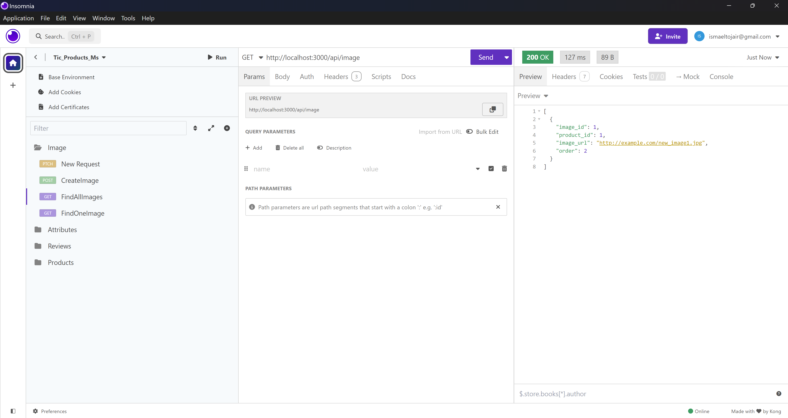

# API Endpoints Documentation

## Products API

### Añadir un nuevo producto
**POST** `/products`  
Permite añadir un nuevo producto al catálogo.

### Obtener todos los productos
**GET** `/products`  
Recupera la lista completa de productos en el catálogo.

### Obtener un producto por ID
**GET** `/products/:id`  
Recupera la información de un producto específico por su ID.

### Actualizar un producto por ID
**PUT** `/products/:id`  
Actualiza los datos de un producto existente por su ID.

### Eliminar un producto por ID
**DELETE** `/products/:id`  
Elimina un producto del catálogo por su ID.

#### Ejemplo de uso en Insomnia

---
## Reviews API

### Añadir una nueva reseña
**POST** `/reviews`  
Permite añadir una nueva reseña para un producto.

### Obtener todas las reseñas
**GET** `/reviews`  
Recupera la lista completa de reseñas.

### Obtener una reseña por ID
**GET** `/reviews/:id`  
Recupera una reseña específica por su ID.

### Actualizar una reseña por ID
**PUT** `/reviews/:id`  
Actualiza los datos de una reseña existente por su ID.

### Eliminar una reseña por ID
**DELETE** `/reviews/:id`  
Elimina una reseña por su ID.

#### Ejemplo de uso en Insomnia

---

## Attributes API

### Crear un nuevo atributo
**POST** `/attributes`  
Permite crear un nuevo atributo.

### Obtener todos los atributos
**GET** `/attributes`  
Recupera la lista completa de atributos.

### Obtener un atributo por ID
**GET** `/attributes/:id`  
Recupera un atributo específico por su ID.

### Actualizar un atributo por ID
**PUT** `/attributes/:id`  
Actualiza un atributo existente por su ID.

### Eliminar un atributo por ID
**DELETE** `/attributes/:id`  
Elimina un atributo por su ID.

#### Ejemplo de uso en Insomnia

---

## Images API

### Asignar una nueva imagen a un producto
**POST** `/images`  
Permite asignar una nueva imagen a un producto desde la API de Unsplash.

### Obtener todas las imágenes
**GET** `/images`  
Recupera la lista completa de imágenes asociadas a productos.

### Obtener una imagen por ID
**GET** `/images/:id`  
Recupera una imagen específica por su ID.

### Actualizar una imagen por ID
**PUT** `/images/:id`  
Actualiza los datos de una imagen existente por su ID.

### Eliminar una imagen por ID
**DELETE** `/images/:id`  
Elimina una imagen por su ID.

#### Ejemplo de uso en Insomnia

