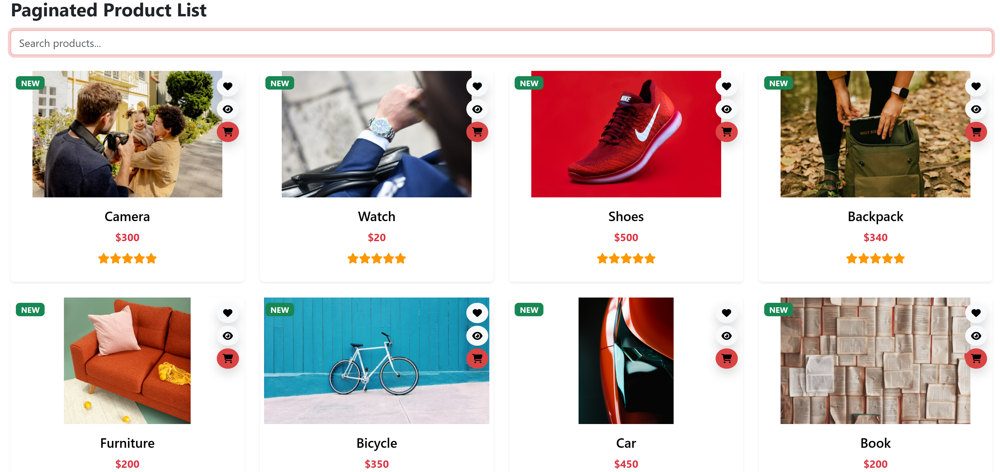
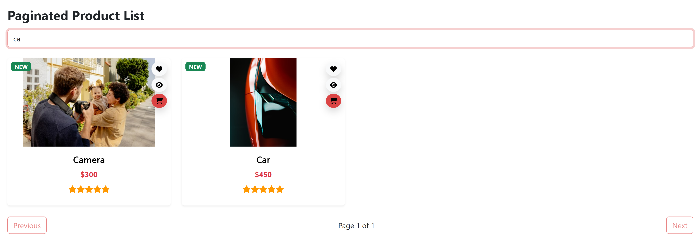
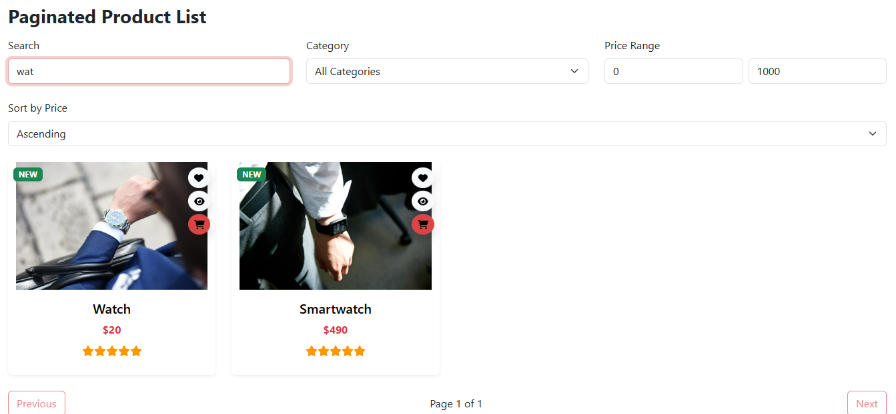
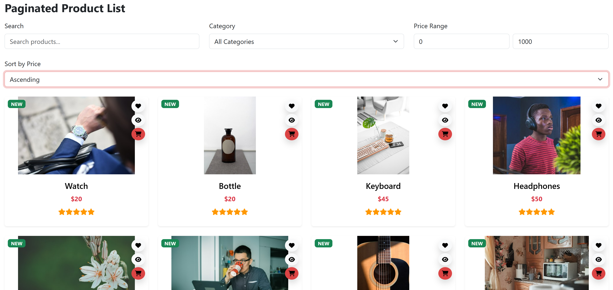
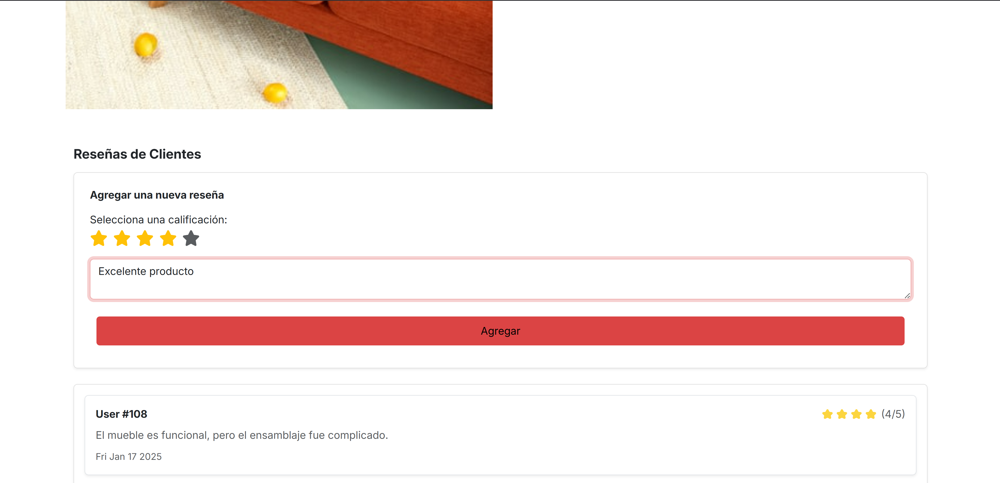
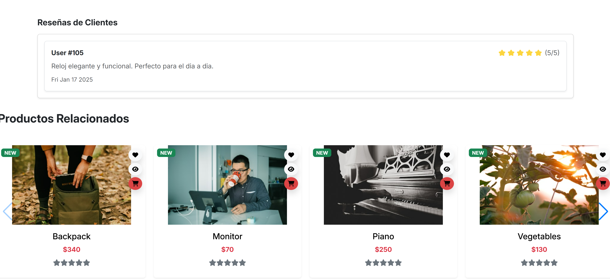
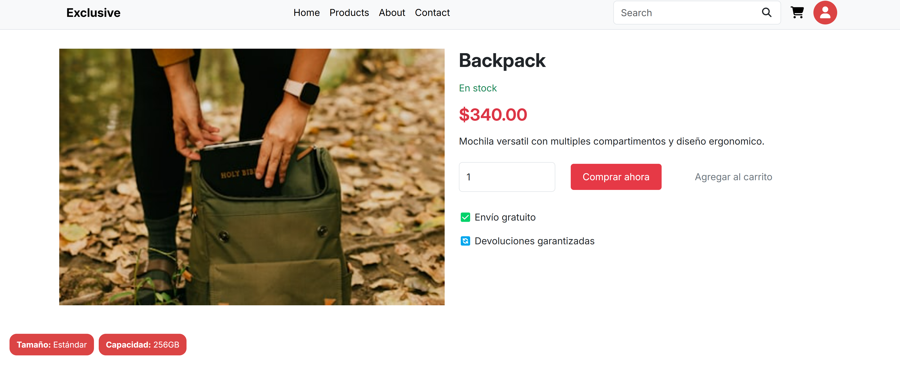
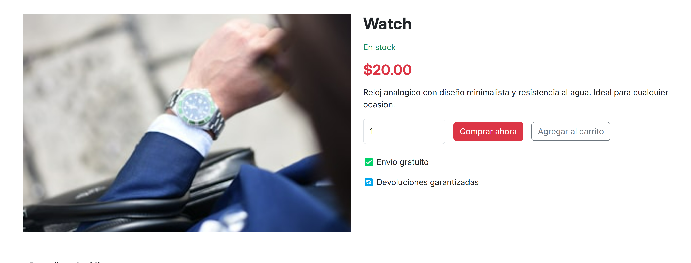

# Resultados de pruebas funcionales

En este documento se presentan los resultados de las pruebas funcionales planteados en el documento de [casos de prueba](./CasosDePrueba.md).

---

## Caso de prueba CP01

### Visualización de productos en el catálogo

| ID   | Descripción                                              | Resultado |
| ---- | -------------------------------------------------------- | --------- |
| CP01 | Visualización de productos en la página principal        | Exitoso   |

### Capturas de pantalla

#### Visualización de productos

---

## Caso de prueba CP02

### Búsqueda de productos

| ID   | Descripción                     | Resultado |
| ---- | ------------------------------- | --------- |
| CP02 | Búsqueda de productos por nombre | Exitoso   |

### Capturas de pantalla

#### Búsqueda de productos

---

## Caso de prueba CP03

### Filtrado de productos

| ID   | Descripción                                      | Resultado |
| ---- | ------------------------------------------------ | --------- |
| CP03 | Filtrado de productos por rango de precios       | Exitoso   |

### Capturas de pantalla

#### Filtrado de productos

---

## Caso de prueba CP04

### Ordenamiento de productos

| ID   | Descripción                          | Resultado |
| ---- | ------------------------------------ | --------- |
| CP04 | Ordenamiento de productos por precio | Exitoso   |

### Capturas de pantalla

#### Ordenamiento de productos

---

## Caso de prueba CP05

### Gestión de reseñas de productos

| ID   | Descripción                                      | Resultado |
| ---- | ------------------------------------------------ | --------- |
| CP05 | Creación de reseñas de productos                 | Exitoso   |
| CP05 | Visualización de reseñas asociadas a productos   | Exitoso   |

### Capturas de pantalla

#### Creación de una reseña

#### Visualización de reseñas

---

## Caso de prueba CP06

### Gestión de atributos de productos

| ID   | Descripción                                      | Resultado |
| ---- | ------------------------------------------------ | --------- |
| CP06 | Visualización de atributos dinámicos de productos | Exitoso   |

### Capturas de pantalla

#### Visualización de atributos

---

## Caso de prueba CP07

### Navegación a detalles del producto

| ID   | Descripción                                         | Resultado |
| ---- | --------------------------------------------------- | --------- |
| CP07 | Navegación desde el catálogo a la página de detalles | Exitoso   |

### Capturas de pantalla

#### Detalles del producto

---

Todos los casos de prueba fueron ejecutados exitosamente, validando el correcto funcionamiento del Microfrontend de Catálogo de Productos. Se aclara que, aunque existen endpoints para la edición y eliminación de atributos, estas funcionalidades no se implementaron en el microfrontend debido a que forman parte del backoffice, el cual no es parte del alcance actual.
