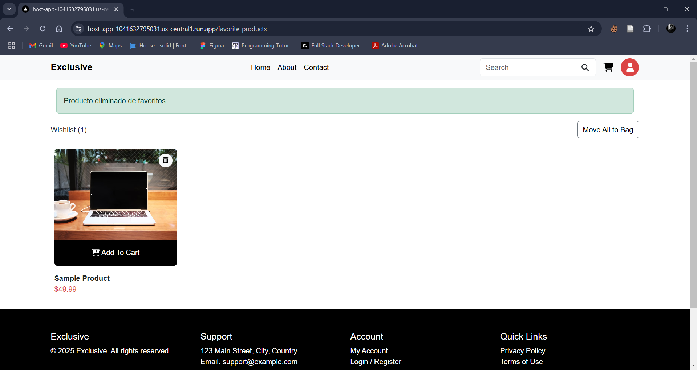

# Resultados de pruebas funcionales

En este documento se presentan los resultados de las pruebas funcionales plateados en el documento de [casos de pruebas](./CasosPrueba.md).

## Caso de prueba CP01

### Registro de usuario

| ID   | Descripción                             | Resultado |
| ---- | --------------------------------------- | --------- |
| CP01 | Registro de usuario con datos válidos   | Exitoso   |
| CP01 | Registro de usuario con datos inválidos | Fallido   |

### Capturas de pantalla

#### Registro de usuario con datos válidos

#### Registro de usuario con datos inválidos

## Caso de prueba CP02

### Inicio de sesión

| ID   | Descripción                          | Resultado |
| ---- | ------------------------------------ | --------- |
| CP02 | Inicio de sesión con datos válidos   | Exitoso   |
| CP02 | Inicio de sesión con datos inválidos | Fallido   |

### Capturas de pantalla

#### Inicio de sesión con datos válidos

#### Inicio de sesión con datos inválidos

## Caso de prueba CP03

### Reset de contraseña

| ID   | Descripción                             | Resultado |
| ---- | --------------------------------------- | --------- |
| CP03 | Reset de contraseña con datos válidos   | Exitoso   |
| CP03 | Reset de contraseña con datos inválidos | Fallido   |

### Capturas de pantalla

#### Reset de contraseña con datos válidos

#### Reset de contraseña con datos inválidos

## Caso de prueba CP04

### Lectura y actualización de perfil

| ID   | Descripción                       | Resultado |
| ---- | --------------------------------- | --------- |
| CP04 | Lectura y actualización de perfil | Exitoso   |

### Capturas de pantalla

#### Lectura y actualización de perfil

## Caso de prueba CP05

### Cambio de contraseña

| ID   | Descripción                              | Resultado |
| ---- | ---------------------------------------- | --------- |
| CP05 | Cambio de contraseña con datos válidos   | Exitoso   |
| CP05 | Cambio de contraseña con datos inválidos | Fallido   |

### Capturas de pantalla

#### Cambio de contraseña con datos válidos

#### Cambio de contraseña con datos inválidos

## Caso de prueba CP06

### Inserción, lectura y eliminación de productos favoritos

| ID   | Descripción                                   | Resultado |
| ---- | --------------------------------------------- | --------- |
| CP06 | Inserción, lectura y eliminación de productos | Exitoso   |

### Capturas de pantalla

<!-- #### Inserción de producto a favoritos -->

<!--   -->

#### Lectura de productos favoritos

#### Eliminación de producto de favoritos

